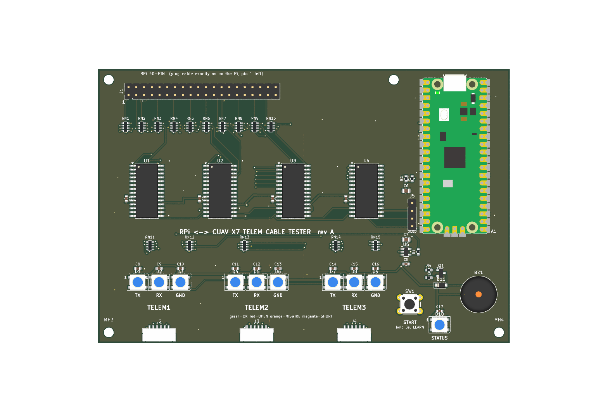

# RPi ↔ CUAV X7 telemetry cable tester

A production tester for the harness that runs from a Raspberry Pi 40-pin header to 3× JST-GH 6-pin (CUAV X7 TELEM1–3). Plug a cable in and get a PASS/FAIL verdict in under a second, with a colour per wire:

| Colour | Meaning |
|---|---|
| green | OK |
| red | open |
| orange | miswired (swapped, wrong cavity, wrong pin) |
| magenta | short |

A wiggle test catches intermittent crimps.



## How it works
- **Test lines.** Every contact on the 40-pin header and on the three JSTs (58 lines) has its own MCP23017 I/O pin, through a 220 Ω resistor. The header's power and GND pins are isolated test lines too.
- **Scan.** The RP2040 drives one line low at a time and reads all the others (a "walking one" scan). That builds the full connection map, which it compares to `wiring.json`.
- **Changing the pinout** needs no new hardware. Either edit `wiring.json` on the board's USB drive, or plug in a known-good cable and hold the button for 3 s (learn mode).
- **Ground wires** may land on any Pi GND pin, because the Pi's grounds are common.

## Layout
| Path | Contents |
|---|---|
| `firmware/` | CircuitPython firmware and PC simulation tests. See [firmware/README.md](firmware/README.md). |
| `hardware/` | KiCad 9 project, generator and check scripts, BOM. See [hardware/README.md](hardware/README.md). |
| `hardware/fab/` | JLCPCB order files: Gerber zip, `BOM_JLC.csv`, `CPL_JLC.csv`. |

## Quick commands
```bash
python firmware/pc_tests/test_tester.py      # firmware logic tests
python hardware/check_design.py              # netlist vs firmware pin map
python hardware/make_jlc.py                  # regenerate JLCPCB files from the board
```
